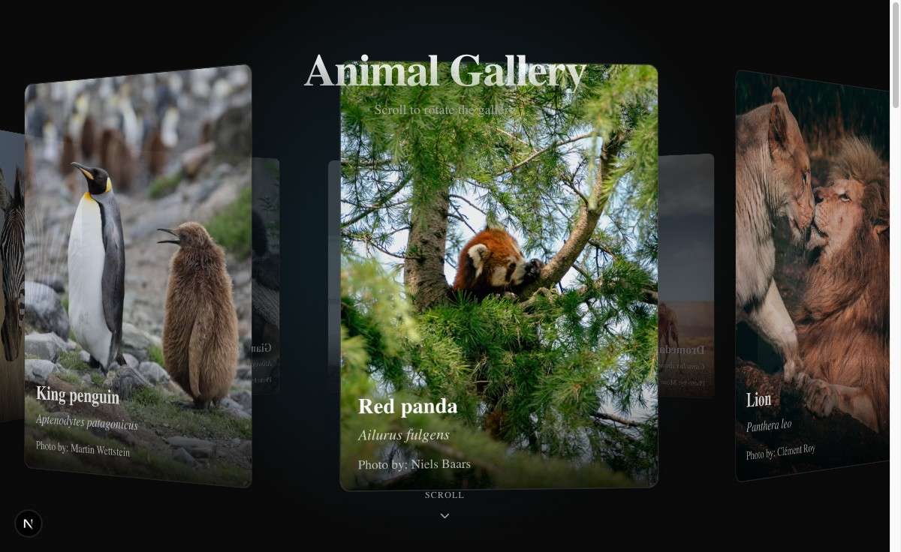
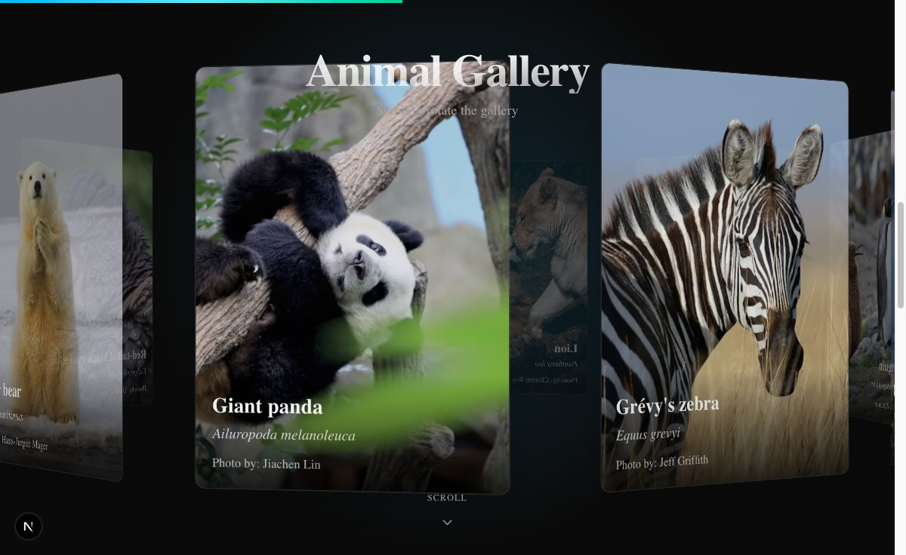

# Circular Gallery — 3D Photo Showcase

A scroll-driven, auto-rotating **circular 3D photo gallery** built on Next.js 16 (App Router),
React 19, Tailwind v4, shadcn (`base-nova`) and TypeScript.




## What it does

- **3D carousel** — 10 cards arranged in a ring via CSS `perspective` + `rotateY`/`translateZ`.
- **Scroll to rotate** — page scroll maps linearly to ring rotation (`scrollProgress * 360°`).
- **Idle auto-rotation** — when you stop scrolling, the ring keeps spinning slowly.
- **Depth fade** — cards facing away dim toward `opacity: 0.3` for real depth.
- **Entrance animation** — title and ring fade/scale in on mount (Framer Motion).
- **Live progress bar** — a spring-smoothed bar at the top tracks scroll position.

## Run it

```bash
npm install      # deps already vendored if cloned from this folder
npm run dev      # http://localhost:3000
```

## Structure

| File | Role |
|------|------|
| `components/ui/circular-gallery.tsx` | The reusable `CircularGallery` component (`"use client"`). |
| `components/ui/demo.tsx` | The showcase: gallery data + animated dark stage. |
| `app/page.tsx` | Renders the demo. |
| `app/layout.tsx` | Sets `dark` mode + metadata. |

## Using the component elsewhere

```tsx
import { CircularGallery, GalleryItem } from "@/components/ui/circular-gallery";

const items: GalleryItem[] = [
  { common: "Lion", binomial: "Panthera leo",
    photo: { url: "...", text: "alt text", pos: "47% 35%", by: "Photographer" } },
  // ...
];

// radius = ring size; autoRotateSpeed = idle spin (deg/frame)
<CircularGallery items={items} radius={600} autoRotateSpeed={0.02} />
```

The component renders inside a tall scroll container with a `sticky top-0` viewport —
the height of that outer container controls how much scrolling = one full rotation.
See `components/ui/demo.tsx` for the exact wrapper.
