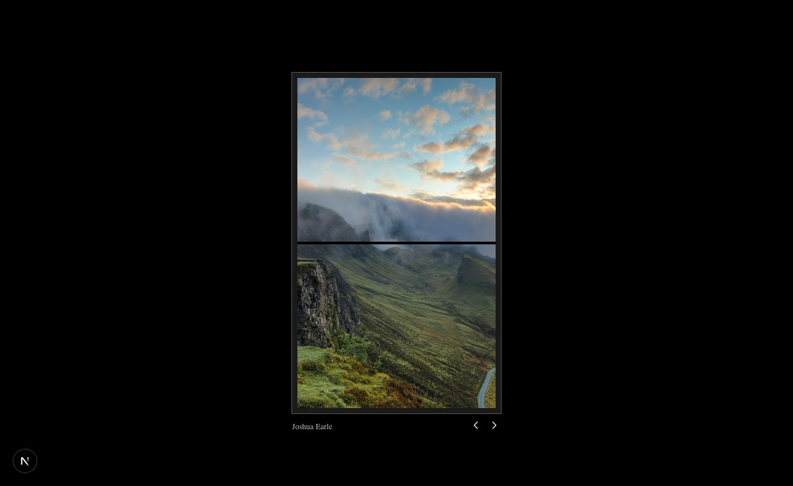

# Flip Gallery — 3D Split-Flap Showcase

A 3D "split-flap" photo gallery — images flip between each other like an airport
departure board (Solari board). Built as a self-contained **shadcn + Tailwind v4 +
TypeScript** Next.js app.



## The component

`components/ui/flip-gallery.tsx` — a single default-exported `FlipGallery` client
component. It uses:

- **`useRef` / `useState`** to track the four stacked panels (`.top`, `.bottom`,
  `.overlay-top`, `.overlay-bottom`) and the current image index.
- The **Web Animations API** (`element.animate(...)`) for the flip keyframes — no
  animation library needed.
- A scoped `<style>` block for the pieces Tailwind can't express (the `::before`
  title, the `::after` hinge line, `transform-origin`, and `background-position`
  splitting the same image across two panels).
- **`lucide-react`** for the prev/next chevrons.

`components/ui/demo.tsx` renders it, and `app/page.tsx` renders the demo.

### Props / state

The component takes **no props** — images are defined in the `images` array at the
top of the file. To use your own photos, edit that array (each entry is
`{ title, url }`). State is fully internal: `currentIndex` plus DOM refs.

### Images

Five verified portrait Unsplash photos (each returns HTTP 200, `600×1000`,
`fit=crop`). Swap the URLs in the `images` array to rebrand.

## Project structure (shadcn defaults)

```
flip-gallery-app/
├── app/
│   ├── globals.css        # Tailwind v4 + shadcn base-nova theme
│   ├── layout.tsx
│   └── page.tsx           # renders the demo
├── components/
│   └── ui/                # shadcn "ui" alias -> @/components/ui
│       ├── flip-gallery.tsx
│       └── demo.tsx
├── lib/
│   └── utils.ts           # cn() helper
└── components.json        # shadcn config (style: base-nova, alias ui -> @/components/ui)
```

`components/ui` is the shadcn convention: the `ui` alias in `components.json`
points at `@/components/ui`, so `shadcn add` and the demo's
`import ... from "@/components/ui/flip-gallery"` both resolve here. Keeping the
folder at that exact path is what makes the component drop-in compatible with the
rest of a shadcn project.

## Run it

```bash
npm install
npm run dev        # http://localhost:3000
```

## Static export (portfolio)

`next.config.ts` sets `output: "export"` with
`basePath = /All_Site/flip-gallery-app/out`, so `npm run build` emits a static
`out/` that serves correctly from the Documents-root portfolio server on
`http://localhost:8000`.

```bash
npm run build      # writes ./out
```

## Setting this up from scratch (if you don't already have a shadcn project)

```bash
npx create-next-app@latest my-app --typescript --tailwind --eslint --app
cd my-app
npx shadcn@latest init          # creates components.json, lib/utils.ts, components/ui
npm install lucide-react
# then drop flip-gallery.tsx into components/ui/
```
