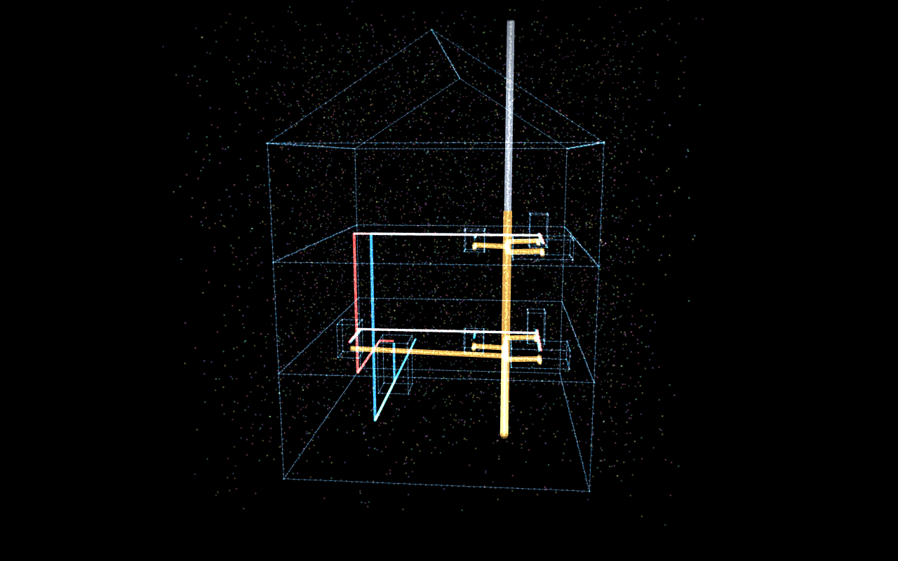
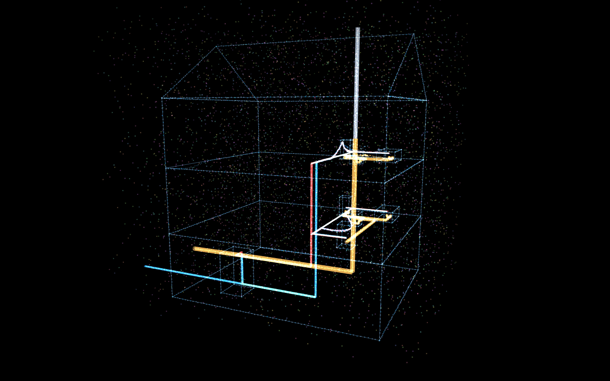

# Woven by Light — Interactive 3D House

The house from the plumbing cutaway, rebuilt in the **`woven-light-hero`** design language —
**text-free, pure interactive design**. A full-screen Three.js canvas where the house is
drawn as **woven light**: a glowing wireframe structure laced with luminous, color-coded
plumbing and a particle "silk". **Hover to disturb the weave** (it springs back) — the whole
structure parallax-tilts toward your cursor. Drag to orbit; it idles with a slow spin + twinkle.

| Idle | Hover (cursor disturbs the weave) |
|------|-----------------------------------|
|  |  |

## Stack (the prompt's requirements, satisfied)

- **shadcn project structure** — `components.json`, `@/` alias, `src/components/ui/`, `src/lib/utils.ts` (`cn`), CSS variables in `src/index.css`.
- **Tailwind CSS** — v3.4 with the standard shadcn theme tokens (`tailwind.config.js`, `postcss.config.js`).
- **TypeScript** — strict mode; `npm run typecheck` passes clean.

## Run it

```bash
cd woven-house-hero
npm install
npm run dev        # http://localhost:5173
# or
npm run build && npm run preview
```

Verified live: `npm run typecheck` clean · `npm run build` succeeds · renders in a headless browser with no runtime errors (only a harmless `favicon.ico` 404).

---

## Integration notes (answers to the prompt's checklist)

### Codebase audit
The parent folder `All_Site/` was **not** a shadcn/Tailwind/TS project, so this is a fresh,
correctly-structured **Vite + React + TypeScript** project — kept separate, not merged into
the parent. shadcn's CLI (`npx shadcn@latest init`) would produce this same layout; it's
pre-wired here so `npx shadcn@latest add <component>` works out of the box.

### Default paths
- Components: **`src/components/ui/`** (alias `@/components/ui`)
- Styles: **`src/index.css`**
- Utils: **`src/lib/utils.ts`**

### Why `/components/ui` matters
shadcn's convention is that **primitive, reusable UI lives in `components/ui`** while your
app-specific composed components live in `components/`. The `components.json` `aliases.ui`
points the CLI here, so every `shadcn add` drops files into a predictable place, imports
resolve via the `@/components/ui/...` alias, and the component is portable across any
shadcn project without path rewrites. The demo imports exactly as the prompt specified:
`import { WovenLightHero } from "@/components/ui/woven-light-hero";`

### Dependencies installed
- `three` + `@types/three` — the 3D house / particle weave
- `framer-motion` — the headline + button entrance choreography
- `lucide-react` — the `House` glyph in the nav (replaces the original `⎎` text glyph)
- `clsx` + `tailwind-merge` — the shadcn `cn()` helper

### Questions the prompt told me to ask — answered for this build
- **What props/data?** None required. `WovenLightHero` is self-contained (zero props). It now renders **only the 3D design** — no text, nav, or button. Natural extension: expose `className` or overlay your own content on top.
- **State management?** Local only — all Three.js state lives inside the canvas `useEffect` and is fully disposed on unmount (no leaks, no global store).
- **Required assets?** **None.** No raster assets, and no fonts/network calls anymore (the text and its Google Fonts link were removed). The visual is fully generated at runtime (geometry + a canvas-drawn particle sprite).
- **Responsive behavior?** Full-viewport (`h-screen w-full`). The canvas tracks its container via `ResizeObserver` + the window `resize` event.
- **Best place to use it?** As a full-bleed hero/background — overlay your own copy on top, or drop it straight into the `hargrove-plumbing` site as an interactive section.

## What changed vs. the original `woven-light-hero`
Stripped to **pure interactive design** — the headline, paragraph, nav, button, and fonts are
removed. The Three.js canvas no longer renders a torus-knot particle field — it renders **the house**:

- glowing structural wireframe (3 floors + gable roof)
- color-coded plumbing as luminous additive tubes — 🔵 cold supply, 🔴 hot supply, 🟠 drain/waste/soil stack, ⚪ vent stack through the roof
- a particle "weave" sampled along every pipe + edge (colored by system) plus a 5,000-point halo of stray silk
- **hover-reactive**: particles repel from the cursor and spring back (the original "woven silk" physics); the whole structure parallax-tilts toward the pointer; idle slow-spin + size twinkle; drag-to-orbit

> Note: the geometry is a clean schematic of a residential DWV + supply system — accurate
> topology and relationships, idealized layout — not a literal trace of the source photo.
