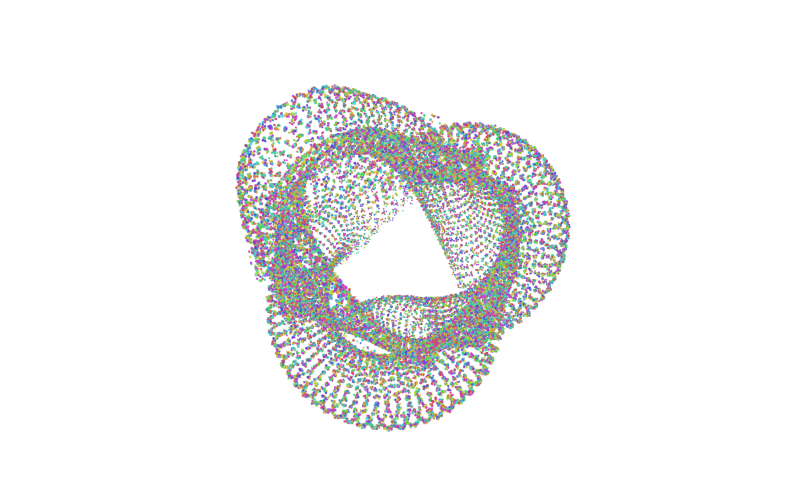

# Woven Light — Interactive Background

The original **`woven-light-hero`** component, faithful to the source — but **background only, no text**,
tuned for a **white-background page**. 50,000 particles are bound to a torus-knot, vivid rainbow-tinted,
slowly rotating, and **repelled by your cursor** (they spring back to their woven positions). No headline,
nav, or button — just the living backdrop.



## Stack (the prompt's requirements, satisfied)

- **shadcn project structure** — `components.json`, `@/` alias, `src/components/ui/`, `src/lib/utils.ts` (`cn`), CSS variables in `src/index.css`.
- **Tailwind CSS** — v3.4 with the standard shadcn theme tokens.
- **TypeScript** — strict mode; `npm run typecheck` passes clean.

## Run it

```bash
cd woven-light-bg
npm install        # already installed if cloned with node_modules
npm run dev        # http://localhost:5173
# or
npm run build && npm run preview
```

## Default paths

- Components: **`src/components/ui/`** (alias `@/components/ui`)
- Styles: **`src/index.css`** · Utils: **`src/lib/utils.ts`**

Why `/components/ui`: it's shadcn's convention so the CLI (`npx shadcn@latest add ...`) drops primitives
in a predictable place and `@/components/ui/...` imports resolve everywhere. The demo imports exactly as
the prompt specified: `import { WovenLightHero } from "@/components/ui/woven-light-hero";`

## Integration notes (the prompt's checklist)

- **Props/data?** None. `WovenLightHero` is self-contained and renders only the background.
- **State?** Local only — all Three.js state lives in the canvas `useEffect`, fully disposed on unmount.
- **Required assets?** **None.** No Unsplash images, no icons, no fonts — the text (and its Google Fonts link) was removed, so there is nothing to fill. Pure WebGL.
- **Responsive?** Full-viewport (`h-screen w-full`); the canvas tracks its container via `ResizeObserver` + window `resize`.
- **Best place to use it?** As a full-bleed background behind your own content — `position: relative` parent, drop your UI in a higher `z-index` layer on top.

## Faithful to the original, minus the text

Kept exactly: the torus-knot woven silk, 50k particles, HSL rainbow, cursor-repulsion physics
(radius 1.5, spring-back, damping 0.95), slow `rotation.y`. Removed: headline, paragraph, nav,
button, framer-motion, fonts.

## Safari / WebKit hardening

The original `gl.POINTS`-on-a-CPU-loop pattern has several Safari-specific failure modes. Fixed:

- **Soft round point-sprite** (a generated radial-gradient texture) instead of bare GL points — Safari rasterizes hard-square points harshly, causing shimmer/flicker during motion. Soft sprites also look better everywhere.
- **WebGL context-loss recovery** — `webglcontextlost` calls `preventDefault()` (required for the GPU to ever re-issue the context) and the render loop resumes on `webglcontextrestored`. Without this, Safari leaves the canvas **permanently black** after a tab-switch or memory-pressure drop. *Verified in WebKit: context lost → restored, `glError: 0`, rendering resumes.*
- **DPR capped at 1.5** (was 2) — a full-screen Retina canvas at DPR 2 has ~78% more pixels to fill; Safari throttles hardest here on battery. Cut the framebuffer from 2560×1600 → 1920×1200 at 1280-CSS-px with no visible quality loss.
- **Scalar physics loop + squared-distance early-out** — no per-particle `Vector3` allocations and no `sqrt` for the ~99% of particles outside the cursor radius. Keeps the main thread cheap so Safari holds 60 FPS under low-power throttling.
- **Pointer events** (`pointermove`/`pointerleave`) instead of `mousemove` — works for trackpad, touch, and pen (Safari + iOS).
- **`setAnimationLoop` + `visibilitychange`** — pauses rendering when the tab is hidden (battery, no backgrounded jank).
- **`powerPreference: "high-performance"`** — asks Safari for the better GPU.

Verified in **Playwright WebKit (Safari's engine, WebKit 26.5)**: 60 FPS at framebuffers up to 3840×2160, zero GL errors, interaction + context-recovery confirmed.

## White vs. dark background

Currently tuned for **white**: `bg-white` wrapper, `renderer.setClearColor(0xffffff,1)`, **NormalBlending**, and
vivid mid-dark hues (`setHSL(h, 0.85, 0.42)`) so each strand reads as color on white. To go back to the
original **dark glow** look, set the wrapper to `bg-black`, clear color to `0x000000`, switch the material to
`THREE.AdditiveBlending`, and lighten the hues (`0.8, 0.5`). (Additive *adds* light, so it vanishes on white —
that's why white needs NormalBlending.)

> Separate from `../woven-house-hero` (the 3D-house variant) — this one is the literal original background.
